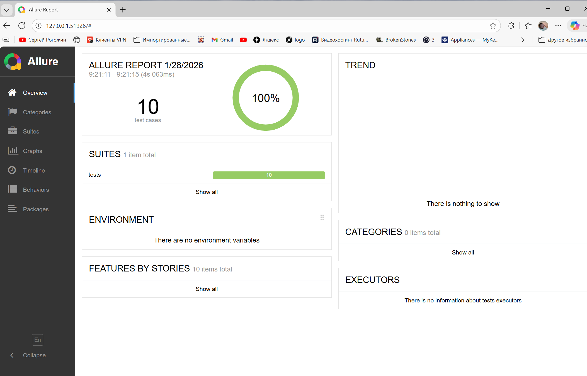
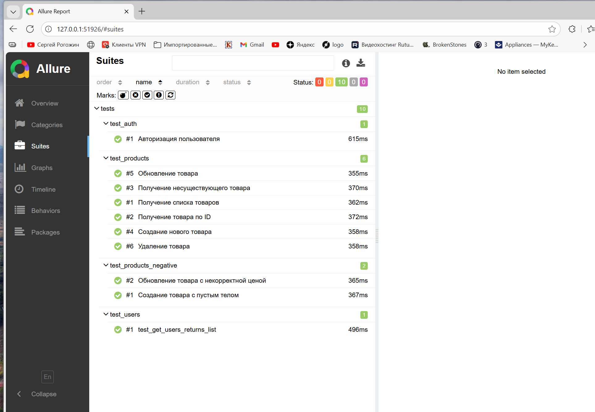

# API Test Automation Project

## 📌 Описание
Проект по автоматизации тестирования REST API на Python.  
Тестирование реализовано на основе публичного API https://fakestoreapi.com.

Проект демонстрирует:
- работу с REST API
- написание автотестов на Pytest
- проверку CRUD операций
- валидацию ответов
- работу с негативными сценариями
- формирование отчётов Allure

---

## 🛠 Технологии
- Python 3.10+
- Pytest
- Requests
- Allure
- JSON Schema
- Git

---

## 📂 Структура проекта

api-testing-fakestore/
│
├── tests/ # автотесты
│ ├── test_products.py
│ ├── test_auth.py
│
├── schemas/ # JSON-схемы
│ └── product_schema.json
│
├── utils/
│ ├── api_client.py # клиент для работы с API
│ └── schema.py # валидация схем
│
├── conftest.py # фикстуры
├── pytest.ini
├── requirements.txt
└── README.md
---

## 🔍 Что покрыто тестами

### Products
- Получение списка товаров
- Получение товара по id
- Создание товара
- Обновление товара
- Удаление товара
- Проверка структуры ответа
- Негативные сценарии

### Auth
- Авторизация пользователя
- Проверка получения токена

---

## ▶ Запуск проекта

### 1. Установка зависимостей

## ▶ Run tests


```bash
pip install -r requirements.txt

Run tests:

pytest

Run Allure report:

pytest --alluredir=allure-results
allure serve allure-results

## 📊 Allure Report
Allure report contains:
- test execution results
- step-by-step test flow
- request/response validation
- error details

## 📌 Notes
FakeStoreAPI is a demo API.
Some endpoints may return нестандартные ответы (e.g. 200 instead of 404).
Tests are adapted to real API behavior.

## 👩‍💻 Author
Ekaterina Mancova 
QA Automation Engineer

## 📊 Allure Report

### Test execution overview


### Test suites
